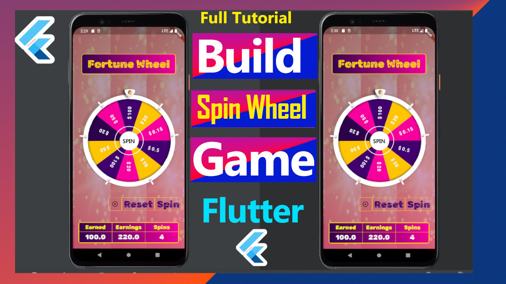
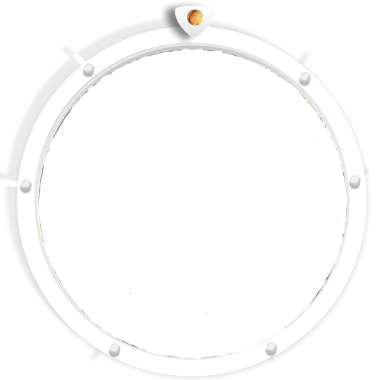
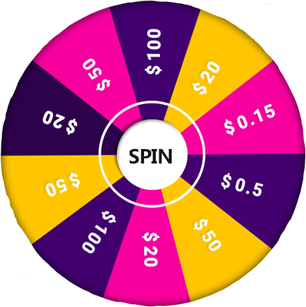

Spin wheel game built with Flutter frameworks  <a href="https://youtu.be/KT2mG0qZXM0">Watch Full Tutorial On Youtube</a> 

<b/r> 
Asset contains the background,  spin wheel and the belt images  If you are interested with source code get it here, Not Free though <a href="https://t.me/codingtony">Get source code</a>   
  
